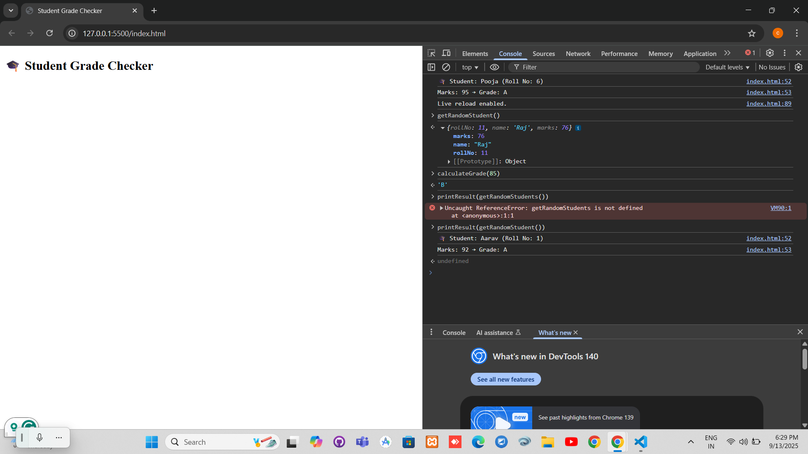

# 🎓 Student Grade Checker

Student Grade Checker is a simple JavaScript project that randomly selects a student and calculates their grade.  
It demonstrates the use of arrays, conditions, and ES6 arrow functions.

## 🚀 How to Run
1. Clone or download this repository.  
2. Open `index.html` in your browser.  
3. Open **DevTools Console** (`F12` → Console tab).  
4. You’ll see a random student’s grade printed in the console.

## 📸 Screenshot

